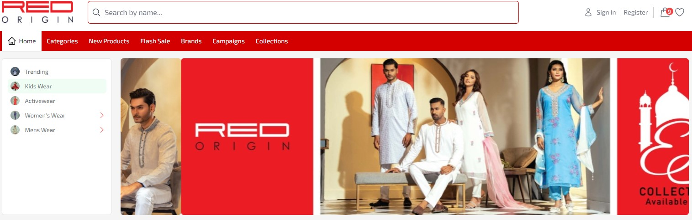

<hr><p></p>
<h1>Red Origin Fashion</h1>
<hr><p>Red Origin is eminent lifestyle brand in the retail fashion industry of Bangladesh with a purpose of Sailing life. As a fashion brand Red Origin is renowned for its unique style and variety of collections.</p><h2>Technologies Used</h2>
<hr><ul>
<li>HTML</li>
</ul><ul>
<li>CSS</li>
</ul><ul>
<li>JavaScript</li>
</ul><ul>
<li>React</li>
</ul><ul>
<li>Bootstrap</li>
</ul><ul>
<li>Next js</li>
</ul><h2>Features</h2>
<hr><ul>
<li>Ecomerce</li>

</ul><h2>Setup</h2>
<hr><p>Node Version   v16.18.0
Npm Version 8.15.0
React 18</p>

```sh

        "@emotion/react": "^11.10.5",
        "@emotion/styled": "^11.10.5",
        "@mui/material": "^5.11.9",
        "@reduxjs/toolkit": "^1.9.0",
        "apple-signin-auth": "^1.7.5",
        "axios": "^1.2.0",
        "bcrypt": "^5.1.0",
        "cookie-parser": "^1.4.6",
        "cookies-next": "^2.1.1",
        "country-codes-list": "^1.6.10",
        "express": "^4.18.2",
        "formik": "^2.2.9",
        "i18next": "^22.4.9",
        "next": "13.0.5",
        "next-i18next": "^13.0.2",
        "next-redux-wrapper": "^8.0.0",
        "rc-slider": "^10.1.0",
        "rc-tooltip": "^5.2.2",
        "react": "18.2.0",
        "react-apple-login": "^1.1.6",
        "react-bkash": "^3.0.0",
        "react-countdown": "^2.3.5",
        "react-dom": "18.2.0",
        "react-facebook-login": "^4.1.1",
        "react-google-login": "^5.2.2",
        "react-html-parser": "^2.0.2",
        "react-i18next": "^12.1.5",
        "react-img-zoom": "^0.1.0",
        "react-infinite-scroll-component": "^6.1.0",
        "react-inner-image-zoom": "^3.0.2",
        "react-loader-spinner": "^5.3.4",
        "react-loading-skeleton": "^3.1.0",
        "react-messenger-chat-plugin": "^3.0.5",
        "react-messenger-customer-chat": "^0.8.0",
        "react-paginate": "^8.1.4",
        "react-redux": "^8.0.5",
        "react-slick": "^0.29.0",
        "react-slider": "^2.0.4",
        "react-to-print": "^2.14.11",
        "react-toastify": "^9.1.1",
        "reactjs-social-login": "^2.6.1",
        "slick-carousel": "^1.8.1",
        "swiper": "^8.4.5",
        "yup": "^0.32.11"

```

```sh

   # Steps
   ## npm install
   ### npm run build

```

<h2>Contact</h2>
    <hr>
    <p><span style="margin-right: 30px;"></span><a href="https://github.com/mediasoftbd/Red Origin_frontend"></a></p>
# Red Origin_frontend
# red_origin_frontent
